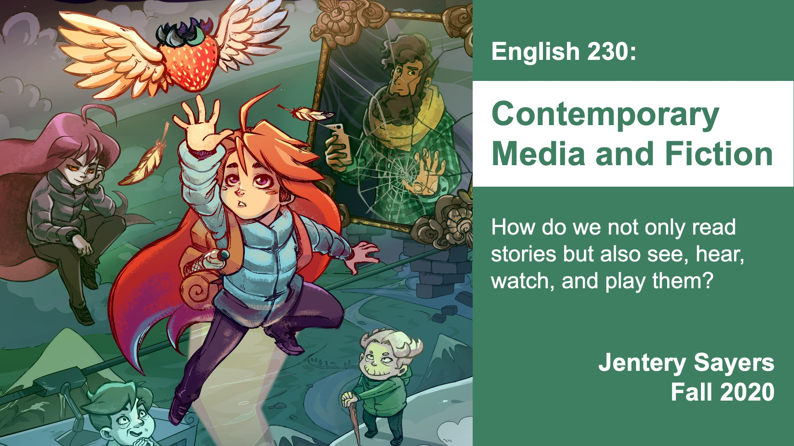

This is an FAQ for undergraduate students in my English 230 course, "Contemporary Media and Fiction" (Fall 2020), at the University of Victoria. I'll circulate the complete course outline in September, but you can check this draft [schedule](schedule.html) in the meantime. Thank you for your patience.  

## What Will We Study? 

We'll examine the role of media in contemporary fiction. This means we'll talk a lot about audio, images, and text: how we read works of fiction but also play, watch, and listen to them. 

Here's a list of works we'll study in the course:

* The graphic novel and memoir, [*Fun Home*](http://www.houghtonmifflinbooks.com/booksellers/press_release/bechdel/) (2006), by Alison Bechdel 
* The speculative fictions, ["Message in a Bottle"](https://tachyonpublications.com/product/falling-love-hominids/) (2004), by Nalo Hopkinson, and [*The Fifth Season*](https://www.orbitbooks.net/orbit-excerpts/the-fifth-season/) (2015; excerpts), by N.K. Jemisin  
* Experimental fiction such as [*With Those We Love Alive*](http://collection.eliterature.org/3/work.html?work=with-those-we-love-alive) (2014), by Porpentine and Brenda Neotenomie, and [*THE M00D OF THE MOMENT*](https://www.yhchang.com/THE_MOOD_OF_THE_MOMENT_V.html) (2007), by Young-Hae Chang Heavy Industries
* The animated short film, [*Biidaaban (The Dawn Comes)*](https://www.youtube.com/watch?v=vWjnYKyiUB8) (2018), by Amanda Strong and Leanne Betasamosake Simpson 
* The role-playing game, [*Undertale*](https://undertale.com/) (2015), by Toby Fox and Temmie Chang
* The platforming game, [*Celeste*](http://www.celestegame.com/) (2018), by Extremely Ok
* The first-person game, [*Gone Home*](https://gonehome.game/) (2013), by the Fulbright Company 
* The adventure puzzle game, [*Secrets Agent*](https://even-kei.itch.io/secrets-agent) (2014), by Marina Kittaka 
* The interactive crime fiction, [*Her Story*](http://www.herstorygame.com/about/) (2014), by Sam Barlow 
* The dramatic podcast, [*Within the Wires*](http://www.nightvalepresents.com/withinthewires) (2016), by Jeffrey Cranor, Janina Matthewson, and Mary Epworth 

If this ends up being too much for the term, then we'll cut material, or some of it will be optional. 

I'm asking you to purchase only *one* of these works: Bechdel's *Fun Home*. I'm also providing you with a free, online textbook on contemporary media and fiction.

## What Will We Learn? 

In "Contemporary Media and Fiction" (English 230),  you'll learn to: 

* Interpret audio, images, and text in the context of contemporary fiction. We'll practice various techniques for listening, watching, reading, and playing media, and you'll develop a vocabulary for talking about media and fiction together.  
* Communicate critically with audio, images, and text. You'll have opportunities to practice composing across these media. I will assume you have no previous experience with media production.  
* Use media as forms of evidence in arguments and criticism. You'll learn to integrate audio, images, and even video alongside quotations in your writing about fiction. 
* Make a simple website, compose some content for it, and publish it using your UVic webspace. No worries if you've never made your own site. I'll provide you with examples and templates, which you can copy, paste, and edit. I will assume no experience in web design or content management. I will not ask you to purchase any software, and I'll provide you with instructions for passcode-protecting the websites you make. 

All four of these outcomes should apply to work across disciplines and occupations, regardless of your major at UVic. They are all incredibly useful when you're interpreting media and writing for the web.

## What Are the Assignments? 

I'm asking you to do two things this term: 

* Create, design, and maintain a simple research blog with 10 entries, each responding to a prompt in the course textbook (the blog will be marked three times; the first two marks will each be 25% of your final grade; the final mark will be 30% of your final grade) 
* Participate in online discussion forums with your peers (two marks, each 10% of your final grade)

There are no essays or presentations required for this course. There is no exam, either. I'll be grading your work with Faith Ryan, the course TA. 

## What Do I Need to Purchase? 

The textbook for "Contemporary Media and Fiction" (English 230) will be available online for free. I wrote it with teaching and learning at UVic in mind. It's intended primarily for UVic students. Each chapter is available in audio and text formats for listening and/or reading. 

The only text I'm asking you to purchase is a copy of Bechdel's *Fun Home* (print or ebook), which is available at the [UVic Bookstore](https://www.uvicbookstore.ca/text/book/9780618871711?course_id=10001). It's $25 new and $18.75 used. 

I'll provide you with a course packet, too, and point you to various materials published online. I will recommend some games and books that you can purchase, if you wish.

You do not need to purchase any software for this course; however, you'll need access to the internet and a computer. 

## When Will We Meet, and How Is the Course Structured? 

We'll have *one* Zoom meeting each week: *Tuesdays, from 10:30 to 11:20am.* Weekly Zoom meetings will be dedicated to discussion, not lecture, and attendance will be optional. I may occasionally treat them as opportunities to clarify materials in the textbook and to address your questions. You will be welcome to participate via chat, audio, or video. My contributions to these Zoom meetings will be recorded in case you're unable to attend them.  

Aside from weekly Zoom meetings, I will hold two optional office hours each week (days and times to be determined). They will be open to everyone in the course, and I will use Zoom for those as well.  

All other aspects of "Contemporary Media and Fiction" (English 230) will unfold asynchronously. I'll ask you to study (read, watch, listen, or play) a work of fiction every week or two. The course textbook, much like a lecture, will provide you with terminology and explain approaches to these works. It will also include prompts for your blog, for which you'll produce 10 entries during the term. Chapters in the textbook are available in text and audio formats, meaning you can read and/or listen to them.  

## Is There a Draft Schedule Available? 

There is, indeed! [Check it out](schedule.html). I've included due dates and links to materials. 

## Will There Be a Course Brightspace? 

There will be! I've just not finished it quite yet. We'll use Brightspace for scheduling, discussion forums, video recordings, and updates. The rest will happen on your blogs, through Zoom, and in the class textbook. (I'll circulate the link to the textbook in September.) 

## How Many of Us Will There Be? 

The course is full, with a cap of 60, plus Faith Ryan (teaching assistant) and me. So . . . 62 of us? 

## How Will We Study Games? What If I Cannot or Do Not Want to Play Them?  

I've selected five indie games for us to interpret and discuss. They are available across platforms, such as Itch, which is DRM-free. If you'd rather not purchase or play them, then you're welcome watch no-commentary gameplay videos of them. 

You'll access other formats (including podcasts, animations, and experimental fiction) online, and you can read *Fun Home* in print or on an e-reader.

I'll include samples of assigned works in our weekly Zoom meetings. This way, we can read, watch, play, and listen to parts of them in the same space (while abiding by copyright and fair dealing guidelines).  

## Will You Circulate a Technology Survey? 

I will send you a brief survey at the beginning of the term. It should take you no more than ten minutes to complete. You can respond to it to tell Faith and me how you'll be accessing Zoom meetings and course materials, including any technologies you'll be using during the term. You can also respond to it to let Faith and me know other things you'd like us to consider as we proceed with "Contemporary Media and Fiction" (English 230). 

## Where Can I Learn More about the Course? 

The Department of English published this [description](https://www.uvic.ca/humanities/english/assets/docs/Course%20Descriptions/230-sayers--fall-2020.pdf) of "Contemporary Media and Fiction" (English 230) earlier this year. Please note some changes: for example, we are now meeting only on Tuesdays, and there is no exam. 

Here's a poster for the course: 

The image in the poster is for Extremely Ok's *Celeste*. 

## Who Are You? 

My name is Jentery Sayers (he / him / his). I'm an Associate Professor in the English department, where I also direct the [Praxis Studio](https://uvicpraxis.github.io/) for Comparative Media Studies. I've been at UVic since 2011, and I did my PhD at the University of Washington in Seattle. I teach and write about media, fiction, and culture in the 20th and 21st centuries. You can contact me at [jentery@uvic.ca](mailto:jentery@uvic.ca). I'm happy to chat with you about any aspect of this course, and I'll be available by email in August and early September, prior to our first meeting on September 15th.  
